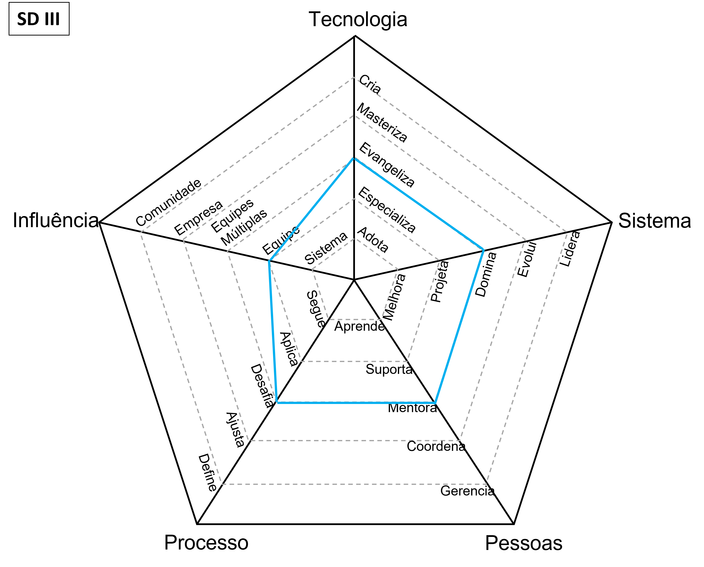

# Desenvolvedor

Papel também conhecido como pessoa desenvolvedora, programador ou engenheiro de software, requer um profundo nível de conhecimento técnico.

| Classe | Posição |
| :---: | :---: |
| 13 | [Software Developer](#software-developer) |
| 14 | [Software Developer I](#software-developer-i) |
| 15 | [Software Developer II](#software-developer-ii) |
| 16 | [Software Developer III](#software-developer-iii) |
| 17 | [Software Developer Specialist](#software-developer-specialist) |

## Software Developer

<picture>
  
</picture>

* **Adota**: aprende e adota ativamente a tecnologia e as ferramentas definidas pela equipe
* **Melhora**: implementa com sucesso novos recursos e correções de bugs para melhorar e estender o sistema
* **Aprende**: aprende rapidamente com os outros e avança consistentemente quando necessário
* **Segue**: segue os processos da equipe, entregando um fluxo consistente de funcionalidades para a produção
* **Sistema**: causa impacto em um ou mais subsistemas

## Software Developer I

<picture>
  
</picture>

* **Adota**: aprende e adota ativamente a tecnologia e as ferramentas definidas pela equipe
* **Projeta**: projeta e implementa recursos de tamanho médio a grande, reduzindo a dívida técnica do sistema
* **Suporta**: apóia proativamente outros membros da equipe e os ajuda a ter sucesso
* **Aplica**: aplica os processos da equipe, certificando-se de que todos entendam os benefícios e compensações
* **Sistema**: causa impacto em um ou mais subsistemas

## Software Developer II

<picture>
  
</picture>

* **Specializes**: is the go-to person for one or more technologies and takes initiative to learn new ones
* **Designs**: designs and implements medium to large size features while reducing the system's tech debt
* **Supports**: proactively supports other team members and helps them to be successful
* **Challenges**: challenges the team processes, looking for ways to improve them
* **Team**: makes an impact on the whole team, not just on specific parts of it

## Software Developer III

<picture>
  
</picture>

* **Evangelizes**: researches, creates proofs of concept and introduces new technologies to the team
* **Owns**: owns the production operation and monitoring of the system and is aware of its SLAs
* **Mentors**: mentors others to accelerate their career-growth and encourages them to participate
* **Challenges**: challenges the team processes, looking for ways to improve them
* **Team**: makes an impact on the whole team, not just on specific parts of it

## Software Developer Specialist

<picture>
  
</picture>

* **Masters**: has very deep knowledge about the whole technology stack of the system
* **Evolves**: evolves the architecture to support future requirements and defines its SLAs
* **Mentors**: mentors others to accelerate their career-growth and encourages them to participate
* **Adjusts**: adjusts the team processes, listening to feedback and guiding the team through the changes
* **Multiple Teams**: makes an impact not only on the whole team but also on other teams

## D6 - Developer 6

<picture>
  
</picture>

* **Creates**: designs and creates new technologies that are widely used either by internal or external teams
* **Leads**: leads the technical excellence of the system and creates plans to mitigate outages
* **Mentors**: mentors others to accelerate their career-growth and encourages them to participate
* **Adjusts**: adjusts the team processes, listening to feedback and guiding the team through the changes
* **Company**: makes an impact on the whole tech organization

## D7 - Developer 7

<picture>
  
</picture>

* **Creates**: designs and creates new technologies that are widely used either by internal or external teams
* **Leads**: leads the technical excellence of the system and creates plans to mitigate outages
* **Mentors**: mentors others to accelerate their career-growth and encourages them to participate
* **Adjusts**: adjusts the team processes, listening to feedback and guiding the team through the changes
* **Community**: makes an impact on the tech community

# Outras páginas

* [**Carreira de engenharia**](README.md)