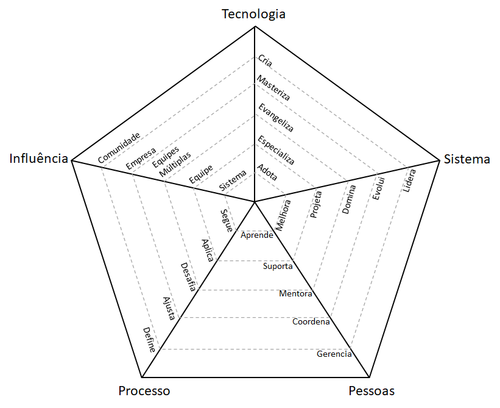

# Carreira de engenharia

**Esta estrutura NÃO representa um documento oficial do contratante do mantenedor e destina-se somente a uso pessoal.**

Este framework permite que os líderes de engenharia de software tenham conversas significativas com seus liderados diretos sobre as expectativas de cada posição e como planejar o próximo nível em sua carreira.

Esse framework foi traduzido da estrutura original em www.engineeringladders.com e adaptado para um cotidiano particular.

São usados gráficos de radar para representar visualmente as diferentes perspectivas e expectativas de uma determinada posição:

<picture>
  <source media="(prefers-color-scheme: dark)" srcset="charts/template-dark.png">
  <source media="(prefers-color-scheme: light)" srcset="charts/template.png">
  
</picture>

# Carreiras

* [**Software Developer**](Developer.md): Papel também conhecido como pessoa desenvolvedora, programador ou engenheiro de software, requer um profundo nível de conhecimento técnico.

| Classe | [Software Developer](Developer.md) |
| :---: | :---: |
| 13 | [Software Developer](Developer.md#d1---developer-1) |
| 14 | [Software Developer I](Developer.md#d2---developer-2) |
| 15 | [Software Developer II](Developer.md#d3---developer-3) |
| 16 | [Software Developer III](Developer.md#d4---developer-4) |
| 17 | [Software Developer Specialist](Developer.md#d5---developer-5) |

# Eixos

O gráfico mostrado acima tem os seguintes 5 eixos:
* **Tecnologia**: conhecimento da pilha de tecnologia e ferramentas.
* **Sistema**: nível de 'ownership' no(s) sitema(s) e produto(s).
* **Pessoas**: Relacionamento com o time e demais colaboradores.
* **Processos**: Nível de engajamento com o processo de desenvolvimento.
* **Influência**: Escopo de influência da posição.

O eixo **influência** pode ser visto como uma *dimensão diferente*, pois é ortogonal e se aplica a todos os outros eixos.

O eixo **sistema** pode ser visto como o *domínio* que o colaborador possui em relação aos sistemas seja na capacidade de garantir a evolução corroborando a visão de produto.

Cada eixo tem 5 níveis diferentes de desempenho. É importante destacar que todo nível inclui o(s) anterior(es). Por exemplo, alguém que, *evangeliza* tecnologia, *especializa*, logo, também *adota*.

Continue lendo para entender melhor cada nível.

# Níveis

## Tecnologia

1. **Adota**: aprende e adota ativamente a tecnologia e as ferramentas definidas pela equipe
2. **Especializa**: é a pessoa certa para uma ou mais tecnologias e toma iniciativa para aprender novas
3. **Evangeliza**: pesquisa, cria provas de conceito e apresenta novas tecnologias para a equipe
4. **Masteriza**: tem conhecimento muito profundo sobre toda a pilha de tecnologia do sistema
5. **Cria**: projeta e cria novas tecnologias que são amplamente utilizadas por equipes internas ou externas

## Sistema

1. **Melhora**: implementa com sucesso novos recursos e correções de bugs para melhorar e estender o sistema
2. **Projeta**: projeta e implementa recursos de tamanho médio a grande, reduzindo a dívida técnica do sistema
3. **Domina**: possui a operação de produção e monitoramento do sistema e está ciente de seus SLAs
4. **Evolui**: evolui a arquitetura para dar suporte a requisitos futuros e define seus SLAs
5. **Lidera**: lidera a excelência técnica do sistema e cria planos para mitigar interrupções

## Pessoas

1. **Aprende**: aprende rapidamente com os outros e avança consistentemente quando necessário
2. **Suporta**: apóia proativamente outros membros da equipe e os ajuda a ter sucesso
3. **Mentora**: orienta outras pessoas para acelerar o crescimento e as incentiva a participar
4. **Coordena**: coordena os membros da equipe, fornecendo feedback e moderando as discussões
5. **Gerencia**: gerencia as expectativas, o desempenho e o nível de satisfação dos membros da equipe

## Processos

1. **Segue**: segue os processos da equipe, entregando um fluxo consistente de funcionalidades para a produção
2. **Aplica**: aplica os processos da equipe, certificando-se de que todos entendam os benefícios e compensações
3. **Desafia**: desafia os processos da equipe, buscando formas de melhorá-los
4. **Ajusta**: facilita o ajuste dos processos da equipe, ouvindo feedback e orientando a equipe nas mudanças
5. **Define**: define os processos adequados ao nível de maturidade da equipe, equilibrando agilidade e disciplina

## Influência

1. **Subsistema**: causa impacto em um ou mais subsistemas
2. **Equipe**: causa impacto em toda a equipe, não apenas em partes específicas dela
3. **Equipes Múltiplas**: causa impacto não apenas em sua equipe, mas também em outras equipes
4. **Empresa**: causa impacto em toda a organização de tecnologia
5. **Comunidade**: causa impacto na comunidade de tecnologia

# FAQs

**E se algumas pessoas não atenderem a todos os pontos?**

Isso é muito normal, as pessoas geralmente são mais fortes em algumas áreas e mais fracas em outras. A estrutura não deve ser usada como uma lista de verificação para promover as pessoas, mas sim como orientação para conversas significativas sobre carreira.

**E se o plano de carreira da empresa for diferente?**

A estrutura é de código aberto, você tem a oportunidade de adaptá-la ou melhor ainda, apoiar na evolução desta a partir de pull requests.

**Quando uma pessoa está pronta para passar para o próximo nível?**

Geralmente sugiro que uma pessoa tenha um desempenho do próximo nível *consistentemente por um ciclo de carreira*, com isso evidencias são coletadas antes de uma promoção ser formalizada.

**Como faço para coletar evidências para apoiar a discussão com meus subordinados diretos?**

Equipes diferentes coletam evidências de maneiras diferentes. Uma abordagem recomendada é usar uma combinação de:
* Conversas de 1:1
* Feedback de colegas e outras equipes
* Autoavaliação

**O framework poderia fornecer exemplos mais específicos de comportamento para dar suporte a cada nível?**

Exemplos específicos de comportamento requerem conhecimento sobre a forma como a equipe trabalha, a arquitetura do sistema e sua pilha de tecnologia. Recomenda-se permitir que cada equipe defina seus próprios exemplos.

# Outras páginas

* [**Software Developer**](Developer.md)